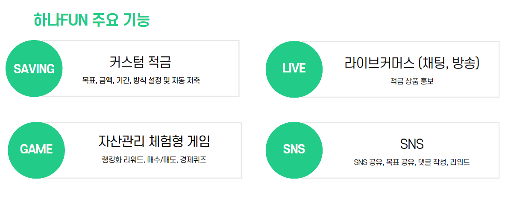
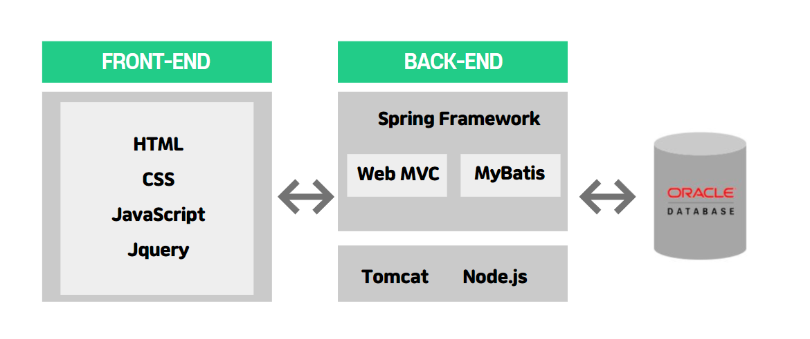

# 쉽고 재미있는 저축 - 하나FUN

[프로젝트 홈페이지 - https://koposoftware.github.io/2021_19_jhhwang/](https://koposoftware.github.io/2021_19_jhhwang/)

# 1. 프로젝트 개요

&nbsp;&nbsp;저금리가 장기화되면서 단순 이자를 벗어난 매력 포인트가 필요해졌고, 이러한 상황에서 재미있고 이벤트를 통해 이득을 볼 수 있는 펀 세이빙 상품들이 부각되기 시작했습니다. 

MZ세대는 자기중심적 소비, 디지털 네이티브, 재미를 추구하는 특징을 가지고 있습니다. 경험소비와 재미를 중요시하는 MZ세대에서 이러한 상품들은 더욱 눈에 띄게 되었고 고객의 니즈에 부합하기 위해 다양한 펀 세이빙 상품을 내고 있는 상황입니다.

따라서, 하나FUN은 MZ세대 온라인 영상 시청 트렌드를 반영한 라이브커머스, 경험소비와 재미를 중요시하는 MZ세대를 위한 FUN요소를 결합해 빠르게 변화하는 MZ세대를 공략하는 적금상품입니다.

# 2. 프로젝트 결과
최종 프로젝트 결과입니다.

## * 발표 ppt 
    
   [최종발표자료](/최종PPT.pptx) 

## * 시연 동영상 

   <iframe id="ytplayer" type="text/html" width="640" height="360" src="https://www.youtube.com/watch?v=lnKLZfgSPWQ&ab_channel=%EC%B5%9C%EB%AF%BC%EA%B8%B0" frameborder="0"></iframe>

# 3. 프로젝트 결과 요약

## * 수행기간
   2021-09-06 ~ 2021-10-05

## * 담당업무
   하나FUN 프로젝트 설계 및 제작, Front-End/Back-End 개발

## * 주요기능
   

## * 사용기술
- Spring-MVC 패턴
- Scheduler를 활용한 반복적인 작업 및 시간에 따른 이벤트 처리
- WebRTC를 활용하여 라이브커머스 및 채팅 구현
- JSOUP을 활용하여 게임 뉴스카드 데이터 크롤링
- SMS/KAKAO API를 활용하여 가입 알림 및 목표 공유
- JavaScript & Css 라이브러리를 활용하여 게임 및 룰렛 구현
- Spring Security(BCrypt)를 활용하여 비밀번호 암호화

## * 개발환경
- OS : Window10
- Framework : Spring Framework 4, Mybatis
- Server : Apache Tomcat9
- Language : Java(jdk-1.8), Javascript, HTML, CSS
- IDE Tools : Eclipse, Sqldeveloper, Visual Studio Code
- DB : Oracle 11g
- Library : jQuery, JSTL, Bootstrap-4.3.1

## * 시스템 아키텍쳐
   
   
## * ERD
   

## * 서비스 구성도
   

## * 보완점
1. 게임공학에 관심이 있어서 게임으로써 금융을 재밌게 표현하려고 노력했지만, 생각했던 것 보다 재밌지 않은 것 같아 아쉬웠습니다. WEB GL과 Three.js 등 다양한 언어 및 라이브러리를 사용하여 전체적인 게임 구조를 3D 그래픽 렌더링을 통해 더욱 재밌는 서비스를 개발해보고 싶습니다. 또한, 미래에 중심으로 들어설 메타버스라는 채널에 이번 프로젝트를 적용하고 싶다는 목표도 생겼습니다.

2. 개발하던 노트북에서 미디어 서버와 톰캣 서버를 같이 돌렸을 때, 서버 최대 수용인원은 느리더라도 20명정도 까지 가능했습니다. 이후에는 1:N 통신에서 새로운 아키텍처를 적용해서 100명, 200명 등 더 많은 사람들을 수용할 수 있는 라이브커머스를 구현해 보고 싶습니다.

# 4. 본인 소개

|이름 |최민기||
|연락처 | cmg321(@)naver.com|
|skill set| Frontend - HTML, CSS, Javascript|
| | Backend - Java, Spring, Oracle|
| | Etc - R, Git|
|특기사항| 배운 내용 다른 사람에게 설명하고 공유하기 |
