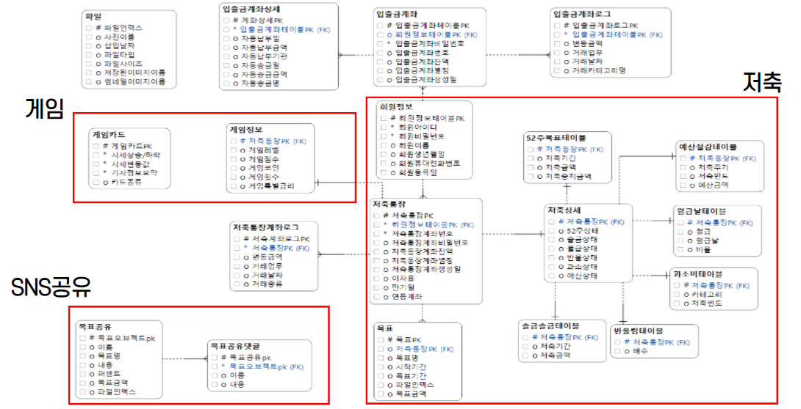

# 쉽고 재미있는 저축 - 하나FUN

[프로젝트 홈페이지 - https://koposoftware.github.io/2021_19_jhhwang/](https://koposoftware.github.io/2021_19_jhhwang/)

# 1. 프로젝트 개요

&nbsp;&nbsp;주식투자 특히 장기투자에 가장 중요한 정보인 거시경제지표를 제공하는 웹 서비스입니다. 기존의 거시경제지표 서비스는 숫자와 그래프의 나열로 이루어져 있고, 입문자에게 진입장벽이 높은 정보입니다. 이에 전문가의 친절한 해석을 통해 이 지표들이 주가에 미치는 영향을 살펴보고, 사용자 간의 정보 공유를 하여 장기투자에 필요한 정보를 얻을 수 있습니다. 그리고 시장의 위기와 기회를 전문가가 판단하여 알림 서비스를 제공합니다.

# 2. 프로젝트 제안서

초기 하나 스톡시그널의 주제 선정 및 제안 발표 자료입니다.
   
    
   [제안발표자료](/스톡시그널_제안발표.pptx)  
   초기 목업 화면입니다. 
     
   주제 제안발표 영상입니다. 
   <iframe width="640" height="360" src="https://www.youtube.com/embed/sggIi6EwXP8" frameborder="0"></iframe>

# 3. 프로젝트 결과
최종 프로젝트 결과입니다.

## * 발표 ppt 
    
   [최종발표자료](/스톡시그널_최종발표.pptx) 

## * 시연 동영상 

   <iframe id="ytplayer" type="text/html" width="640" height="360" src="https://www.youtube.com/embed/6LxbdIjWP04" frameborder="0"></iframe>

# 4. 프로젝트 결과 요약

## * 수행기간
   2021-09-06 ~ 2021-10-05

## * 담당업무
   하나FUN 프로젝트 설계 및 제작, Front-End/Back-End 개발

## * 주요기능
   

## * 사용기술
- Spring-MVC 패턴
- Scheduler를 활용한 반복적인 작업 및 시간에 따른 이벤트 처리
- WebRTC를 활용하여 라이브커머스 및 채팅 구현
- JSOUP을 활용하여 게임 뉴스카드 데이터 크롤링
- SMS/KAKAO API를 활용하여 가입 알림 및 목표 공유
- JavaScript & Css 라이브러리를 활용하여 게임 및 룰렛 구현
- Spring Security(BCrypt)를 활용하여 비밀번호 암호화

## * 개발환경
- OS : Window10
- Framework : Spring Framework 4, Mybatis
- Server : Apache Tomcat9
- Language : Java(jdk-1.8), Javascript, HTML, CSS
- IDE Tools : Eclipse, Sqldeveloper, Visual Studio Code
- DB : Oracle 11g
- Library : jQuery, JSTL, Bootstrap-4.3.1

## * 시스템 아키텍쳐
   
   
## * ERD
   

## * 서비스 구성도
   

## * 보완점
1. 다양한 지표 추가하기
더 많은 지표와 데이터를 포함하여 지표 선택의 범위와 탐색의 범위를 넓힙니다.

2. 전문가 룰의 현재 및 과거 평가
전문가가 추천한 지표 조합이 현재 어떤 신호를 보이는지 평가합니다. 또한, 과거 데이터를 통해 얼마나 높은 예측력을 갖는지 평가합니다.

3. 룰 수정의 자유도
알림의 전문가 룰이 더욱 자유도 있게 수정, 적용되도록 합니다.

4. 뉴스 크롤링 부하개선
여러 사용자가 동시 접근 시 과도한 부하를 개선하기 위해 네이버 뉴스 API를 사용하여 이를 구현합니다. 

# 5. 본인 소개

|이름 |최민기||
|연락처 | cmg321(@)naver.com|
|skill set| Frontend - HTML, CSS, Javascript|
| | Backend - Java, Spring, Oracle|
| | Etc - R, Git|
|특기사항| 배운 내용 다른 사람에게 설명하고 공유하기 |
